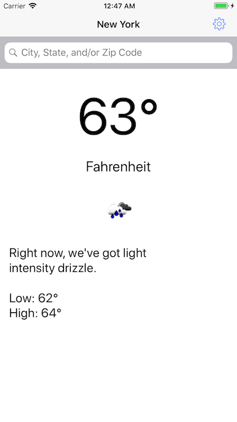

# TEKsystemsWeatherApp

### To run
Run `pod install` in the directory to download the Kingfisher Cocoapod. Then open the newly created `TEKsystemsWeatherApp.xcworkspace` file and compile and run. 

### Requirements Fulfilled
- Allow customer to enter a US city
- Call the openweathermap.org API and display the information you think a user would be interested in seeing. Be sure to has the app download and display a weather icon.
- Auto load the last city searched upon app launch.

### Bonuses Fulfilled
- Unit Tests
- UI Test
- Location Detection

Main Screen|Settings
---|---
|
